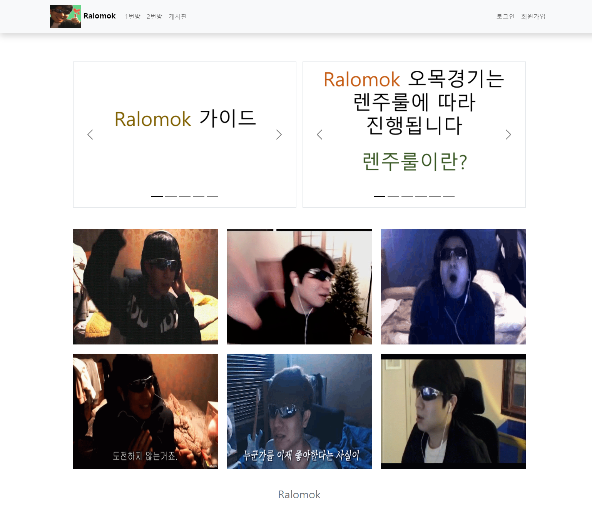

# 📖 Ralomok-V1.0
JSP와 Servlet으로 구현한 렌주룰 오목사이트 입니다.


[Ralomok 바로가기](http://jongbum.site:8080)
<br>

## 프로젝트 소개

- 렌주룰이 적용된 오목을 1대1로 즐길 수 있습니다.
- 실시간 채팅창을 통해 상대와 소통할 수 있습니다.
- 관전할 수 있고, 관전자를 확인할 수 있으며 다른 사람의 전적을 볼 수 있습니다.
- ELO레이팅을 적용하여 점수차이에 따라 차등된 점수를 부여합니다.

<br>

## 팀원 구성

<div align="center">

[ <br/> @jongbum97](https://github.com/jongbum97) 

</div>
<br>

## 0. 실행 가이드
```
1. WebContent/WEB-INF/sql/table.sql 임포트하기 (MySQL)
2. eclipse로 프로젝트 import 후 Run as - Run on Server (jdk 1.8)
```
<br>

## 1. 개발 환경

- Front : JSP, Bootstrap 
- Back-end : Servlet, Java
- 버전 및 이슈관리 : Github

  <br>

## 2. 채택한 개발 기술과 브랜치 전략

### 게임 정보 갱신

  - **Polling**: 실시간으로 상대가 둔 돌의 정보나 채팅내역을 가져오기 위해 Polling 방식을 통해 0.5초마다 서버와 통신합니다.
  - **Fetch**: 비동기를 사용하여 서버에서 가져온 정보만 추가적으로 뿌려주었습니다.

### 렌주룰

- **Ralju.class**: 렌주를을 적용하기 위해 클래스를 만들어 3-3, 4-4, 장목을 판단하는 함수를 구현해 Service에서 호출하여 사용하도록 하였습니다.

### 무르기, 항복 기능

- 실제 오목게임처럼 무르기와 항복 기능을 구현하였습니다.
- 시간제한은 50초로, 초과시 패배하게 됩니다.

### ELO 레이팅

- 1000점이 평균인 ELO레이팅을 적용하여 점수가 높은 상대를 이기면 많은 점수를 획득하고, 반대의 경우엔 적게 획득하도록 구현하였습니다.

### AWS EC2 배포

- EC2 프리티어의 리눅스 환경에 톰캣과 자바를 설치해, 프로젝트를 war파일로 만든 후 배포하였습니다.
- [Ralomok 바로가기](http://jongbum.site:8080)

### 브렌치 전략
- Git-flow 전략을 기반으로 master, develop 브랜치를 운용했습니다.
- master, develop 브랜치로 나누어 개발을 하였습니다.
  - **main** 브랜치는 최종 수정 단계에서만 사용하는 브랜치입니다.
  - **develop** 브랜치는 개발 단계에서 git-flow의 master 역할을 하는 브랜치입니다.

<br>


## 3. 개발 기간 및 작업 관리

### 개발 기간

- 전체 개발 기간 : 2023-9-25 ~ 2022-10-3 (추석연휴)


<br>

## 4. 기능

[게임 기능](./img/Ralomok.mp4)

## 5. 프로젝트 후기


### 👻 김종범

복습삼아 배운것들로 구현할 수 있겠다는 생각이 들어 재밌게 개발하였습니다. <br>
친구들과 플레이 하며 버그를 찾아 고치는것 또한 즐거웠고, 그 과정에서 유지보수의 중요성에 대해 깨달았습니다. <br>
또한 비밀번호가 그대로 DB에 저장되거나, 한친구가 아이디를 계속 만들고 삭제하는 것을 막기 위해 다음 버전에서 이를 개선하고자 합니다.

<br>

